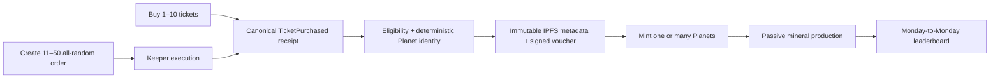

# MegaPlanets

MegaPlanets is a deterministic space-collection game built around the Megapot lottery
on Base. Players buy an eligible Megapot ticket, reveal the Planet encoded by that
ticket's canonical draw data, mint a free Planet NFT, earn off-chain minerals, and
compete on a weekly leaderboard.

> **Current state:** the local MVP and Base Sepolia rehearsal are implemented. The
> seasonless ERC721A V2 is deployed and verified, but checked-in runtime defaults stay
> empty until the API, PostgreSQL, indexer, monitoring, and end-to-end operations gate
> is approved. This repository is not yet a public testnet release.

## The game in one minute



1. Connect a wallet to Base Sepolia.
2. Buy one to ten custom or quick-pick tickets directly through Megapot, or create an
   all-random keeper order for eleven to fifty tickets.
3. After the canonical `TicketPurchased` event is confirmed, MegaPlanets derives the
   Planet from the ticket ID, drawing ID, numbers, bonus ball, and purchase transaction.
4. The API verifies eligibility, generates immutable metadata and a 128×128 animated
   GIF, pins both to IPFS, and signs an EIP-712 mint voucher.
5. Mint one Planet or an atomic batch. The mint is nonpayable: the user pays Base gas,
   not a MegaPlanets mint fee.
6. Owned Planets produce minerals lazily. Same-Type holdings increase the production
   rate, and weekly scores are calculated from the immutable off-chain ledger.

## Game rules

### Tickets and eligibility

- The active network is Base Sepolia (`chainId 84532`). Mainnet is not part of this MVP.
- Direct purchases support one to ten custom or quick-pick tickets through
  `Jackpot.buyTickets`.
- Keeper bulk orders support eleven to fifty all-random tickets through
  `BatchPurchaseFacilitator`. The order quantity is read and passed dynamically; the
  frontend never invents ticket bounds or prices.
- Every purchase uses the source tag `MEGAPLANETS_V1`. The source name is historical
  Megapot attribution and does **not** refer to the unsupported MegaPlanets V1 NFT
  contract.
- Eligibility is based on the canonical execution receipt and `TicketPurchased` event.
  For a keeper order, each execution transaction is the provenance source; the order
  creation transaction is not reused as the Planet seed.
- A ticket can mint exactly one Planet while it is live and owned by the voucher
  recipient. Claimed, burned, duplicate, or currently transferred tickets fail closed.

USDC uses the intentional approve-once policy: the app compares the current allowance
with the exact action amount, sends `approve(spender, maxUint256)` only when allowance
is insufficient, then refetches allowance after a successful receipt. This avoids
repeated approval signatures but gives the route-specific spender permission to pull
more than one purchase amount, so the trade-off must be accepted before deployment.

### Reveal and mint

The browser does not choose Planet traits. The API revalidates the purchase, derives the
canonical seed and traits, pins immutable JSON/GIF metadata to IPFS, and signs a voucher
that binds:

- recipient and live Megapot ticket ID;
- drawing ID and canonical origin transaction hash;
- deterministic seed and traits hash;
- metadata hash and IPFS URI; and
- an expiration timestamp.

The ERC721A V2 contract verifies the signature, current ticket ownership, duplicate
provenance, and batch consistency on-chain. Planet token IDs are sequential and start
at one; they are intentionally different from Megapot ticket IDs. The contract exposes
both `ticketId → planetTokenId` and `planetTokenId → ticketId` mappings.

### Minerals and leaderboard

Each Planet has a deterministic base `mineralsPerDay` value. The API accrues minerals
with fixed-point integer arithmetic when a snapshot is requested or a state transition
occurs; there is no per-second background write job.

| Matching Planets of one Type | Production bonus |
| ---: | ---: |
| 1 | +0% |
| 2 | +5% |
| 3 | +10% |
| 4 or more | +15% |

Transfers settle production for the previous owner at the transfer timestamp and start
a new segment for the recipient. Weekly periods run from Monday 00:00 UTC to the next
Monday 00:00 UTC. A score combines settled ledger entries with active production through
the period cutoff. The MVP has no diversity bonus, XP, colonies, special editions, or
on-chain mineral payouts.

## Deterministic Planets

The generator is shared by the browser, API, and tests. Its canonical seed is the
Keccak-256 hash of standard Solidity ABI encoding:

```text
keccak256(
  abi.encode(
    uint16 generatorVersion,
    uint256 ticketId,
    uint256 drawingId,
    uint8[5] sortedNormals,
    uint8 bonusBall,
    bytes32 originTxHash
  )
)
```

The ten current Types are Nebula, Desert, Triplex, Toxic, Void, Gaia, Volcanic, Gas
Giant, Rocky, and Oceanic. Names, palette, terrain, satellites, rings, rarity, and
minerals are deterministic. Public metadata keeps the attributes in this order:
**Name, Type, Satellites, Minerals, Rarity, Seed**. Ticket ID, drawing ID, origin
transaction hash, and traits hashes remain audit provenance.

Canonical media is a 128×128 pixel-art GIF with 144 frames over twelve seconds. The
frontend scales it with nearest-neighbor rendering; the stored fixture remains the
native logical asset. The following golden fixtures are byte-for-byte regression
examples from the current generator:

| Ticket vector | Derived Planet | Golden GIF |
| --- | --- | --- |
| `ticket-456` · Volcanic · Common | Canonical seed and traits for ticket 456 |  |
| `ticket-1001` · Nebula · Common | Ringed Nebula fixture for ticket 1001 |  |
| `ticket-4242` · Gaia · Uncommon | Gaia fixture for ticket 4242 |  |

The fixture manifest records each input, seed, canonical trait JSON, hashes, and GIF
size: [`manifest.json`](packages/planet-generator/tests/fixtures/manifest.json). Run
the focused golden suite with:

```bash
pnpm --filter @megaplanets/planet-generator golden
```

The GIFs are test fixtures, not a substitute for runtime metadata. Intentional fixture
replacement requires a reviewed `golden:update` run.

## System boundaries

| Boundary | Responsibility |
| --- | --- |
| **Megapot + Base RPC** | Live drawing state, ticket purchases, canonical receipts, and on-chain writes |
| **MegaPlanets ERC721A V2** | Voucher validation, live ticket ownership, one-ticket-one-Planet enforcement, sequential IDs, and provenance mappings |
| **Frontend** | Wallet connection, Play checkout, reveal/mint UX, My Planets, mining overlays, and leaderboard views |
| **API + PostgreSQL** | Eligibility, receipt validation, IPFS pinning, voucher signing, indexed Planet ownership, lazy mining, and leaderboard queries |
| **Finalized indexer** | Confirmation-aware Megapot/Planet event ingestion, cursor hashes, idempotency, bounded reorg recovery, and operational metrics |
| **Planet generator** | DOM-free deterministic traits, metadata, previews, GIF rendering, serialization, and golden outputs |

The normal flow is deliberately split into separate transactions:

```text
Megapot ticket purchase → canonical receipt → API voucher → MegaPlanets mint
→ indexed ownership → lazy minerals → weekly finalization
```

## Deployment identity and release gate

The active seasonless ERC721A V2 deployment is on Base Sepolia:

- Contract: [`0x7a29bfD9d1A7a243A212d4E81bc9A52bE50fb9f2`](https://sepolia.basescan.org/address/0x7a29bfD9d1A7a243A212d4E81bc9A52bE50fb9f2)
- Deployment transaction: [`0xe29aa681e25ba222df04a1acdb2d2e48d2c47ac7cc1d46da0f2e8920ea9f9b6c`](https://sepolia.basescan.org/tx/0xe29aa681e25ba222df04a1acdb2d2e48d2c47ac7cc1d46da0f2e8920ea9f9b6c)
- Deployment block: `45,347,860`
- Verification: Sourcify exact match and BaseScan verification recorded in the repository

The earlier [`0xa94b...5b7c`](https://sepolia.basescan.org/address/0xa94b947256fa977E63a7970CDf513FDD7632d744)
deployment is the unsupported OpenZeppelin ERC-721 V1. It exposes V1-only special-mint
selectors and must never be configured as the V2 Planet contract.

Runtime activation remains environment-only. Keep these values empty in checked-in
defaults and set them together only after the operations gate passes:

```text
VITE_MEGAPLANETS_CONTRACT_ADDRESS
MEGAPLANETS_CONTRACT_ADDRESS
MEGAPLANETS_PLANET_DEPLOYMENT_BLOCK=45347860
```

Keep `MEGAPLANETS_LAUNCH_BLOCK=44997183` and `TICKET_SOURCE=MEGAPLANETS_V1` unchanged.
The remaining gate includes managed PostgreSQL, a long-running finalized indexer,
backfill and replay checks, direct/keeper and batch rehearsals, transfer/burn mining
checks, scheduler/monitoring, backups, and browser E2E coverage.

## Run locally

### Requirements

- Node.js 22 or newer
- pnpm 11 or newer
- An injected EVM wallet for the default local wallet flow
- A Base Sepolia RPC URL for live reads (the public endpoint is suitable for casual development)

### Frontend and local API

```bash
cp .env.example .env.local
pnpm install
pnpm db:generate
pnpm dev
```

The Vite frontend runs on `http://127.0.0.1:5173`. For a production-like local split,
run the API and finalized indexer in separate processes:

```bash
pnpm api:server    # default: http://127.0.0.1:8787
pnpm api:indexer
```

The API exposes health, readiness, metrics, voucher, authentication, Planet, mining,
and leaderboard routes. Check `/api/planets/health`, `/api/planets/readiness`, and
`/api/planets/metrics` before using a configured environment. The browser uses
`VITE_BACKEND_API_BASE_URL` for split frontend/API deployments; same-origin routes are
the local default.

Never commit `.env.local`, private keys, signer material, Pinata credentials, database
URLs, or API keys. The checked-in `.env.example` contains placeholders and intentionally
leaves V2 runtime addresses empty.

## Verification commands

Run the application checks from the repository root:

```bash
pnpm lint
pnpm typecheck
pnpm test
pnpm build
pnpm db:validate
pnpm --filter @megaplanets/planet-generator golden
```

For contract work:

```bash
cd contracts
forge build
forge test
forge inspect MegaPlanets abi --json > abi/MegaPlanets.json
```

## Repository map

- [`src/`](src/) — React/Vite game UI, wallet flows, hooks, and Planet views.
- [`api/`](api/) — Hono API, voucher service, authentication, indexer, mining, and leaderboard.
- [`contracts/`](contracts/) — ERC721A V2 source, ABI, deployment/verification scripts, and Foundry tests.
- [`packages/planet-generator/`](packages/planet-generator/) — canonical deterministic generator and golden fixtures.
- [`docs/PRODUCT_SPEC.md`](docs/PRODUCT_SPEC.md) — product rules and MVP boundaries.
- [`docs/ARCHITECTURE.md`](docs/ARCHITECTURE.md) — API/RPC/indexer and data-flow boundaries.
- [`docs/STATUS.md`](docs/STATUS.md) — current implementation state, deployment record, and blockers.
- [`docs/ROADMAP.md`](docs/ROADMAP.md) — staged delivery plan and release checkpoints.
- [`docs/V2_INDEXER_REHEARSAL_RUNBOOK.md`](docs/V2_INDEXER_REHEARSAL_RUNBOOK.md) — controlled testnet operations runbook.

## License

MIT. The imported Megapot starter-kit license is preserved in [`LICENSE`](LICENSE).
